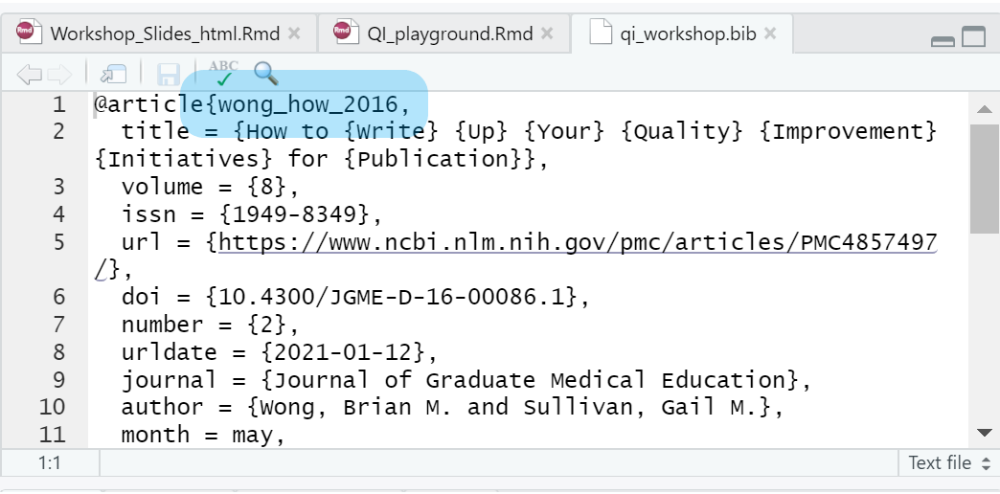

## Global options

The code chunk below sets up some global options for the document. Nothing to do here, but you can learn a trick on how to navigate the document very quickly. See that the code chunk below starts out with this "r setup, include=FALSE". If you look in the very bottom, left corner of the Source pane, you will see an orange hash tag and to the right of it, a dropdown menu. The dropdown menu is automatically created from headings in your document and from the names of the code chunks. The code chunk below is called "setup" because we told the computer that by typing "r setup". The "r" indicates the computer should execute the code in the R language, and the word "setup" is an optional parameter we can include to name the code chunk. The "include=FALSE" part is called a code chunk option, and this particular example is us telling the computer to not show the code in a knit document, but to execute the code.


```{r setup, include=FALSE}

knitr::opts_chunk$set(echo = TRUE)

```

## R Packages and Libraries

Hit the run button on the code below.

Optional note: There are technical differences between packages and libraries that are not important for the beginner to know. When starting out in R, imagine that packages are bundles of code (e.g. little packages) that contain related functions (code that does specific tasks). There many packages available for R, and you can create one if you need to make something very custom. However for the most part, anything commonly done has a package. A quick Google search to find an appropriate package(s) for your task is often the best place to start. Packages can be easily downloaded on to your computer with very little fuss. I have already pre-installed the ones needed for this document. You might use different packages in different projects, and so when you are creating a new R Markdown document, you will need to load the package by calling the library function like below. In short, you install a package once (though you might have to update it from time-to-time) but you need to call it every time you use it for the first time in code.

```{r libraries, warning=FALSE, message=FALSE}
library(readxl)
library(kableExtra)
library(gridExtra)
library(ggsci)
library(extrafont)
library(qcc)
library(SixSigma)
library(runcharter)
library(tidyverse)
library(plotly)
```

# Making plots for your QI project

Ok let's make some plots for your potential QI project!

## Cause and Effect Diagrams

Step 1, press the run button at the top of the code chunk and see the resulting image.

```{r example_ce}
cause.and.effect(cause=list(
  
  People = c("Order illegible", "Phone unanswered", "Heavy Workload"),
  Environment = c("Transcription Error", "Rounding"),
  Materials = c("Out-of-stock", "Spoiled"),
  Methods = c("Too many people", "Lab Handling"),
  Equipment = c("Speed", "Broken Pager", "Phone Capacity")),
  
  effect="Long \ntest \nresults \ntime")

```

Here's your first task. Change the code below to make a cause and effect diagram with your own inputs. A simple change to help you get started; find the place in the code below that looks like `Materials = c("Out-of-stock", "Spoiled")` and change the "Out-of-stock" and "Spoiled" to something else. Run the code chunk and see your change in action.

```{r ce_task}

cause.and.effect(cause=list(
  
  People = c("Order illegible", "Phone unanswered", "Heavy Workload"),
  Environment = c("Transcription Error", "Rounding"),
  Materials = c("Out-of-stock", "Spoiled"),
  Methods = c("Too many people", "Lab Handling"),
  Equipment = c("Speed", "Broken Pager", "Phone Capacity")),
  
  effect="Long \ntest \nresults \ntime")


```

## Histogram

The data for the histogram are generated from code in R that creates simulated data based on some different parameters. This is a good way to make the graphs you want before you have the real data for your project. It also might be helpful when you are deciding whether or not to do a project because if you simulate the best possible results, and they are not "good enough" for the effort, you might choose to tackle a different issue or a different part of the problem.

Your next task is to:

-   Run the code as is and examine the output

-   Change the names of the clinics in the simulated data. Currently they are called Cardiology Clinic and Endocrinology Clinic.

-   Make up a clinic campus name and replace XYZ with a campus name of your choice. Hint: Control + F, works to search a document.

-   Delete the hash before the line of code `theme_bw()`

```{r histo}


# Data generation

clinic_1 <- "Cardiology Clinic"

clinic_2 <- "Endocrinology Clinic"

pre_cards <- tibble(days = round(runif(100, 0, 21)), 
                    intervention = "Before Intervention", 
                    clinic = clinic_1)

post_cards <- tibble(days = round(runif(100, 0, 14)), 
                     intervention = "After Intervention", 
                     clinic = clinic_1)


pre_gi <- tibble(days = round(runif(100, 0, 20)), 
                 intervention = "Before Intervention", 
                 clinic = clinic_2)

post_gi <- tibble(days = round(runif(100, 0, 15)), 
                  intervention = "After Intervention", 
                  clinic = clinic_2)

#Processing the data

data_histo <- bind_rows(pre_cards, post_cards, pre_gi, post_gi)

data_histo$intervention <- as_factor(data_histo$intervention)

data_histo$clinic <- as_factor(data_histo$clinic)

#Plotting the data

plot_data_histo <-  ggplot(data_histo, aes(days, fill = clinic)) +
  
  geom_histogram(binwidth = 1, color = 'white') +
  labs(title = "Days between date of encounter and note signed", 
       subtitle = "Adult Patients at XYZ Campus", 
       y = "Number of Notes", 
       x = "Days", 
       caption="Simulated Data") +
  
  scale_y_continuous(breaks = c(0, 4, 8, 12, 16, 20, 24)) +
 
  facet_grid(intervention ~ clinic) +
  
  scale_color_npg(palette = "nrc")+
  
  scale_fill_npg(palette = "nrc") +
  
#  theme_bw() +
  
  theme(legend.position = "none") +
  
  theme(text=element_text(family = "serif"))


#Showing the plot

plot_data_histo
```


**Bonus**
Just run this to see an example of the same plot but with interactive features.

```{r interactive}
ggplotly(plot_data_histo)
```

## Read Data in from Excel

If you already have data from a project you can read it into R and manipulate it without modifying any of the data in the original files. Many different file formats can be read into R, but here I am using Excel spreadsheet that is stored in this project. All data is simulated, fake, or reproductions of publicly available data. Note: There is an excellent package called `googlesheets4` that makes it easy to import data stored in a Google Sheet into R.

Your tasks:

-   Look at your Environment panel. Do you see anything called `patero` or `fmea`? Hit the run button on the code chunk below. Now look at the Environment panel again. Are they there now?

```{r load_excel}
fake_data <- read_excel("./data/qi_spreadsheet_workshop.xlsx", 
                        sheet = "scatter")

pareto <- read_excel("./data/qi_spreadsheet_workshop.xlsx", 
                     sheet = "Pareto")

fmea <- read_excel("./data/qi_spreadsheet_workshop.xlsx", 
                   sheet = "fmea")
```

## Failure Modes and Effects Analysis

Your task now is to play around with the `kable_styling()` function to change the appearance of the table. Run the code, and look at the table. Now look at options already in the code or use the help search bar to look for kable_styling or type into the console ?kable_styling. Hint: Do something simple like change the font size.

```{r fmea_table}
fmea %>% 
  kable() %>% 
  kable_styling(bootstrap_options = c("striped", "hover"), 
                font_size = 7)
```

## Pareto Chart

Run the code button and look at the graph.

Add the very last part of the code chunk, delete the hash, and then after the `+` sign add the theme function of your choice: `theme_bw()`,`theme_dark()`, `theme_classic()`

Rerun the code chunk and look at the two graphs.

```{r pareto}

plot_pareto <-
  ggplot(pareto, aes(x = reorder(`Error Type`,-`Frequency`),
                     y = `Frequency`)) +
  
  geom_col() +
  
  labs(
    title = "Types of Errors Discovered During Surgical Set-up",
    subtitle = "Pareto Chart",
    x = " ",
    y = "Frequency",
    caption = "Source data from IHI QI Toolkits"
  ) +
  
  scale_x_discrete(
    labels = function(x)
      str_wrap(x, width = 10)
  ) +
  
  annotate("text",
           x = 2,
           y = 75,
           label = "Vital Few") +
  
  annotate(
    "pointrange",
    x = 2,
    y = 70,
    xmin = 1,
    xmax = 3,
    colour = "black",
    size = 1
  ) +
  
  annotate("text",
           x = 6,
           y = 40,
           label = "Useful many") +
  
  annotate(
    "pointrange",
    x = 6,
    y = 35,
    xmin = 4,
    xmax = 8,
    colour = "black",
    size = 1
  ) 


plot_pareto 

#plot_pareto + 
```

## Scatter plot

Run the code below and inspect the plot.

Replace the current function `geom_jitter()` with `geom_point()`.

Re-run the code. What differences do you see? Why might you want to use `geom_jitter()` instead of `geom_point`?

```{r scatter, warning=FALSE}

scatter_plot <-
  ggplot(fake_data, aes(x = count, y = time, color = resident)) +
 
  
  #Hint! 
  geom_jitter() +
  
  labs(
    title = "Average Time from Admission Order to Order Reconciliation Completed",
    subtitle = "Academic Year 2012-2013 \nPGY-2 Residents",
    caption = "Simulated Data",
    x = "Number of Residents on Service",
    y = "Average Time (Mins)"
  ) +
  
  scale_x_continuous(breaks = (1:10)) +
  
  scale_color_jama() +
  
  scale_fill_lancet() +
  
  theme_bw() +
  
  scale_color_discrete(name = "Service Type") +
  
  theme(
    legend.justification = c(1, 0),
    legend.position = c(0.95, 0.4),
    legend.box.background = element_rect(color = "black")
  ) +
  
  theme(text = element_text(family = "serif"))

scatter_plot


```

## Run Charts

[Here](https://www.youtube.com/watch?v=Y2DQp2nkrnk&list=PL4IzsxWztPdljYo7uE5G_R2PtYw3fUReo&index=10) is a great, short talk about Run Charts and background knowledge specific to R by the package author of `runcharter`.

Let's look at the data that comes with the package.

FYI: Dealing with time series data can get very tricky, very quickly.

First, run this code chunk. It will load some data, and show you a table of the first 10 rows the data. What are the columns in your table?

```{r signals_view}
signals <- runcharter::signals

head(signals, 10) %>% 
  kable() %>% 
  kable_styling()

```

Pretend that the column called "grp" are the units of hospital you are interested in studying. Then "y" is the outcome of interest, and "date" is the date of the measurement.

Let's rename the columns to something more clear for the reader.

In the code chunk below:

-   Replace the `"grp"` with a better column header.

-   Replace the `"y"` with a more descriptive header.

-   Run the code again to see the new column names.

```{r my_table_signals}

my_groups <- "grp"

my_outcome <- "y"


head(signals, 10) %>% 
  kable(col.names = c(my_groups,
                      my_outcome,
                      "Dates")) %>% 
  kable_styling()
```

Now let's make the plot that came with the package documentation. Run the code chunk

```{r runchart_example}


runchart_1 <- signals %>% 
  runcharter(med_rows = 7, 
             runlength = 5,
             direction = "both",
             datecol = date, 
             grpvar = grp,
             yval = y, 
             chart_title = "Runs in both directions",
             chart_subtitle = "Runs of 5, from median calculated over first 7 data points in each location")

runchart_1$runchart
```

Let's just look at `WardX`. Run the code below.

```{r wardx}
wardx <- signals %>% filter(grp == "WardX")

runchart_2 <- wardx %>% 
  runcharter(med_rows = 7, 
             runlength = 5,
             direction = "both",
             datecol = date, 
             grpvar = grp,
             yval = y, 
             chart_title = "Runs in both directions",
             chart_subtitle = "Runs of 5, from median calculated over first 7 data points in each location")

runchart_2$runchart
```

## Citation Management

Locate the `qi_workshop.bib` file in the File pane. Open it up and take a peek so the following will make more sense.

Keeping track of your citations and sources can be hard. There are many options, but the workflow I will share is how to cite using a .bib file and a DOI. My standard practice is using Zotero which has nice integration with RStudio with no extra effort on the user's part.

Here's me citing the the paper[@wong_how_2016] that inspired me to make this workshop; it is already in the `qi_workshop.bib` file within this project.

Here is a paper[@fang2019] I semi-randomly found on pubmed.gov examining selective oxidation of things in raw sugar cane. I can cite this using a DOI and then it automatically flows into my `qi_workshop.bib` file!!!

When citing things in an .Rmd have (at least) three options.

1)  Use the syntax of `[@key]` where the key is replaced with the entry, highlighted in blue below, from your `my_generic_citations.bib` file.

```{r bib, echo=FALSE}


```

2.  Use the the visual markdown editor and using the insert citation dropdown menu.

```{r rt_editor, echo=FALSE}


```

```{r insert_citation, echo=FALSE}


```

3.  Or in the visual markdown editor mode use the keyboard shortcut (on windows here) Control + Shift + F8.

# The end (almost)

Knit the document and take a look at the result.

# Side notes

If you use RStudio, you should use projects. I have set this all up for you here, but in general you should use it to manage your data and make it easy to find your data and files and be able to share your code because you will be using relative paths and [not accidentally using absolute paths.](https://github.com/jennybc/here_here#admitting-you-have-a-problem) Don't be overwhelmed by this, but [here is more reading](https://r4ds.had.co.nz/workflow-projects.html#rstudio-projects) for your enjoyment later.

## Session info

```{r session_info, session_info}
sessionInfo()
```

# References
